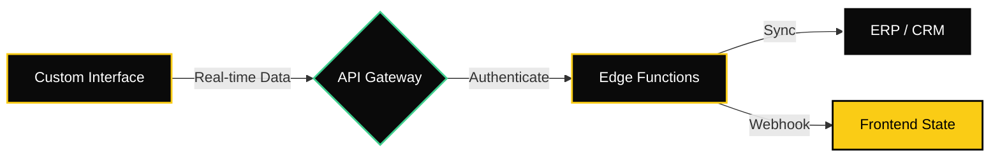

#

  

   
   

  
  
  

   
   

  

    <samp>Beautiful. Bulletproof. Automated.</samp>
  

---

## Overview

**Bryce Digital** builds custom web interfaces—dashboards, portals, data visualizations, and tools—that look unforgettable AND connect seamlessly to backend systems. This isn't template-based development; it's bespoke engineering where Apple-level design meets enterprise-grade integrations.

> "Beautiful web interfaces that connect directly to your systems. Custom dashboards, portals, and data visualizations built for performance and impact."

### What I Build

* **Interactive Dashboards** — Real-time data visualization with 3D elements, scroll animations, and WebGL rendering
* **Enterprise Portals** — Customer-facing interfaces hardwired to NetSuite, Salesforce, and Stripe
* **Data Visualization Tools** — Three.js-powered analytics with 60fps interactions
* **Automation Hubs** — Zero manual entry systems that sync directly with your ERP

---

## Technical Stack

| Category | Technology | Implementation |
| :--- | :--- | :--- |
| **Frontend** |   | App Router, Server Components, Static Export |
| **3D & Animation** |   | WebGL, Scroll-driven animations, Layout transitions |
| **Styling** |  | Custom design system, Dark theme, Glassmorphism |
| **Language** |  | Strict typing, Type-safe APIs |
| **Backend** |  | Database, Auth, Edge Functions |
| **Integrations** |    | SuiteTalk API, Apex, Webhooks |

---

## Reference Architectures

### Crypto Analytics Dashboard
Interactive 3D data visualization with real-time market feeds. Scroll-triggered animations and WebGL rendering for high-frequency financial data. **Built in one weekend** to showcase rapid prototyping capability.

`React • Three.js • WebSocket • Framer Motion • TradingView API`

### Wholesale Order Portal
Custom commerce interface with real-time inventory visualization. Bi-directional sync of 50k+ SKUs and customer-specific pricing tiers.

`React • Next.js • Framer Motion • NetSuite SuiteTalk • Redis`

### Automated CPQ Interface
Interactive quoting dashboard with animated workflows. Generates Salesforce Opportunities and PDF invoices in real-time.

`React • TypeScript • Tailwind • Salesforce Apex • Stripe API`

### Real-Time Fulfillment Hub
Live 3D order tracking visualization. "Domino's Tracker" for manufacturing with animated status updates pulled from ERP via webhooks.

`Next.js • Three.js • Supabase • Twilio • ERP Webhooks`

---

## Architecture

---

## Contact

**Ready to build something unforgettable?**

Book a system audit at [brycedigital.io](https://brycedigital.io) — $997 gets you a technical blueprint, not a sales pitch.

   
  <a href="https://github.com/brambach">GitHub</a> •
  <a href="https://x.com/brycedigital">X</a> •
  <a href="https://linkedin.com/in/bryce-rambach">LinkedIn</a>
   
   
  <samp>© 2025 Bryce Digital. All rights reserved.</samp>

